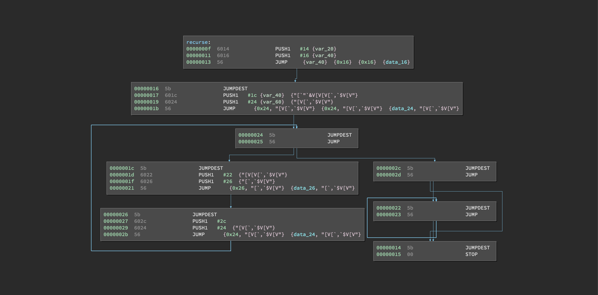
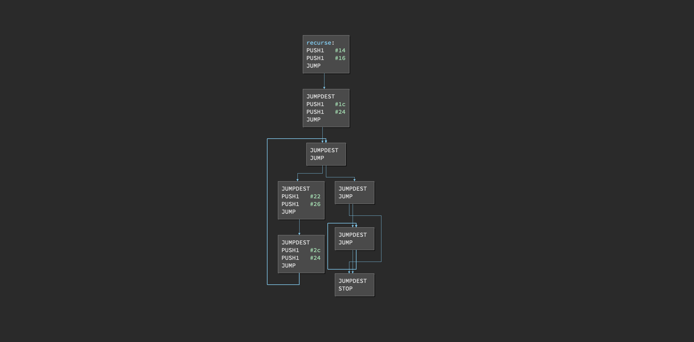

# ethersplay
Binary Ninja plugin which enables an EVM disassembler and related analysis tools.


- [Installation](#installation)
- [How to use](#how-to-use)
- [Automatic Analyses](#automatic-analyses)
- [Plugins](#plugins)
- [Known issues](#known-issues)

## Installation
**Ethersplay only supports Python >= 3.6.**

Ensure that your Binary Ninja's Python library is set to Python 3.6+. You can change the ScriptingProvider in the Advanced Settings.

Install the dependencies:
```console
$ pip install -r requirements.txt
```

Create a symbolic link to the Binary Ninja [plugin folder](https://github.com/Vector35/binaryninja-api/tree/dev/python/examples#loading-plugins).
E.g., in macOS
```
cd ~/Library/Application\ Support/Binary\ Ninja/plugins
ln -s <your_download_location>/ethersplay/ethersplay .
```

Ubuntu:
```
cd ~/.binaryninja/plugins
ln -s <your_download_location>/ethersplay/ethersplay .
```

## How to Use

Ethersplay takes as input the evm bytecode in raw binary format.
 
To have the bytecode of a solidity file, use `solc`:
- `solc --bin-runtime file.sol`: to print the bytecode of the runtime part of the contract (for most of the cases).
- `solc --bin file.sol`: to print the initialisation bytecode of the contract (constructor),


Example using `test.sol` with following contents:
```test.sol:
contract Test {
    uint256 value;
    function Test() {
        value = 5;
    }
    function set_value(uint256 v) {
        value = v;
    }
    function() payable {}
}
```

Run solidity to compile:
`solc --bin-runtime test.sol`

solc prints the bytecode to stdout in the format below:
```
======= test.sol:Test =======
Binary of the runtime part:
60606040523615603d576000357c0100000000000000000000000000000000000000000000000000000000900463ffffffff168063b0f2b72a146041575b5b5b005b3415604b57600080fd5b605f60048080359060200190919050506061565b005b806000819055505b505600a165627a7a72305820c177a64bf54a26574918ddc2201f7ab2dd8619d6c3ee87ce9aaa1eb0e0b1d4650029
```

Copy the ascii hex string, and then create a new file in Binary Ninja. Right-click and select `Paste From -> Raw Hex`. The output should look identical to the earlier example image. Save this file as `test.evm` and close it. Alternatively, paste the ascii hex string into a new text file, and run the `utils/convert_bytecode.py` on that file.

`test.evm` can now be loaded into Binary Ninja.

**Note:** The file must end in `.evm` to be recognized as an EVM bytecode binary file.

## Plugins

### Render Flowgraphs
Generates a clean control flow graph of all functions.

Before:


After:


### Manticore coverage
Colors the basic blocks explored through Manticore (using the `visited.txt` or `*.trace` files).
